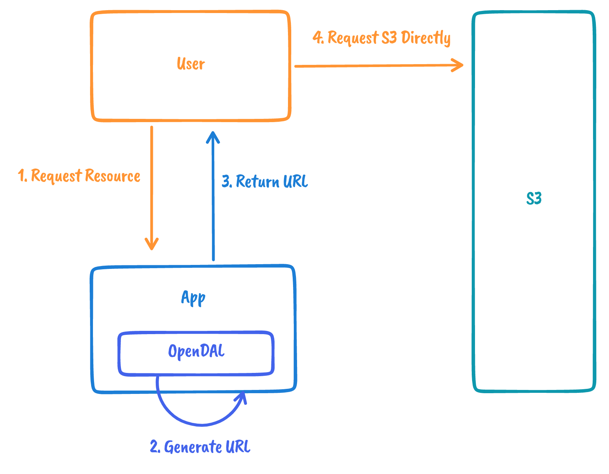

- Proposal Name: `presign`
- Start Date: 2022-06-30
- RFC PR: [datafuselabs/opendal#0413](https://github.com/datafuselabs/opendal/pull/413)
- Tracking Issue: [datafuselabs/opendal#394](https://github.com/datafuselabs/opendal/issues/394)

# Summary

Add presign support in OpenDAL so users can generate a pre-signed URL without leaking `serect_key`.

# Motivation

> By default, all S3 objects are private. Only the object owner has permission to access them. However, the object owner can optionally share objects with others by creating a presigned URL, using their own security credentials, to grant time-limited permission to download the objects.
>
> From [Sharing objects using presigned URLs](https://docs.aws.amazon.com/AmazonS3/latest/userguide/ShareObjectPreSignedURL.html)

We can use this presigned URL for:

- Download the object within the expired time from a bucket directly
- Upload content to the bucket on client-side

Adding this feature in OpenDAL will make users' lives easier to generate presigned URLs across different storage services.

The whole process would be:



# Guide-level explanation

With this feature, our users can:

## Generate presigned URL for downloading

```rust
let req = op.presign_read("path/to/file")?;
// req.method: GET
// req.url: https://s3.amazonaws.com/examplebucket/test.txt?X-Amz-Algorithm=AWS4-HMAC-SHA256&X-Amz-Credential=access_key_id/20130721/us-east-1/s3/aws4_request&X-Amz-Date=20130721T201207Z&X-Amz-Expires=86400&X-Amz-SignedHeaders=host&X-Amz-Signature=<signature-value>  
```

Users can download this object directly from the s3 bucket. For example:

```shell
curl <generated_url> -O test.txt
```

## Generate presigned URL for uploading

```rust
let req = op.presign_write("path/to/file")?;
// req.method: PUT
// req.url: https://s3.amazonaws.com/examplebucket/test.txt?X-Amz-Algorithm=AWS4-HMAC-SHA256&X-Amz-Credential=access_key_id/20130721/us-east-1/s3/aws4_request&X-Amz-Date=20130721T201207Z&X-Amz-Expires=86400&X-Amz-SignedHeaders=host&X-Amz-Signature=<signature-value>  
```

Users can upload content directly to the s3 bucket. For example:

```shell
curl -X PUT <generated_url> -T "/tmp/test.txt"
```

# Reference-level explanation

`Accessor` will add a new API `presign`:

```rust
pub trait Accessor {
    fn presign(&self, args: &OpPresign) -> Result<PresignedRequest> {..}
}
```

`presign` accepts `OpPresign` and returns `Result<PresignedRequest>`:

```rust
struct OpPresign {
    path: String,
    method: http::Method,
    expire: time::Duration,
}

struct PresignedRequest {}

impl PresignedRequest {
    pub fn method(&self) -> http::Method {..}
    pub fn url(&self) -> &str {..}
}
```

We are building a new struct to avoid leaking underlying implementations like `hyper::Request<T>` to users.

This feature will be a new capability in `AccessorCapability` as described in [RFC-0409: Accessor Capabilities](./0409-accessor-capabilities.md)

Based on `Accessor::presign`, we will export public APIs in `Operator`:

```rust
impl Operator {
    fn presign_read(&self, path: &str) -> Result<PresignedRequest> {}
    fn presign_write(&self, path: &str) -> Result<PresignedRequest> {}
}
```

Although it's possible to generate URLs for `create`, `delete`, `stat`, and `list`, there are no obvious use-cases. So we will not add them to this proposal.

# Drawbacks

None.

# Rationale and alternatives

## Query Sign Support Status

- s3: [Authenticating Requests: Using Query Parameters (AWS Signature Version 4)](https://docs.aws.amazon.com/AmazonS3/latest/API/sigv4-query-string-auth.html)
- azblob: [Delegate access with a shared access signature](https://docs.microsoft.com/en-us/rest/api/storageservices/delegate-access-with-shared-access-signature)
- gcs: [Signed URLs](https://cloud.google.com/storage/docs/access-control/signed-urls) (Only for XML API)

# Prior art

## awscli presign

AWS CLI has native presign support

```shell
> aws s3 presign s3://DOC-EXAMPLE-BUCKET/test2.txt
https://DOC-EXAMPLE-BUCKET.s3.us-west-2.amazonaws.com/key?X-Amz-Algorithm=AWS4-HMAC-SHA256&X-Amz-Credential=AKIAEXAMPLE123456789%2F20210621%2Fus-west-2%2Fs3%2Faws4_request&X-Amz-Date=20210621T041609Z&X-Amz-Expires=3600&X-Amz-SignedHeaders=host&X-Amz-Signature=EXAMBLE1234494d5fba3fed607f98018e1dfc62e2529ae96d844123456
```

Refer to [AWS CLI Command Reference](https://awscli.amazonaws.com/v2/documentation/api/latest/reference/s3/presign.html) for more information.

# Unresolved questions

None.

# Future possibilities

- Add `stat`/`list`/`delete` support
