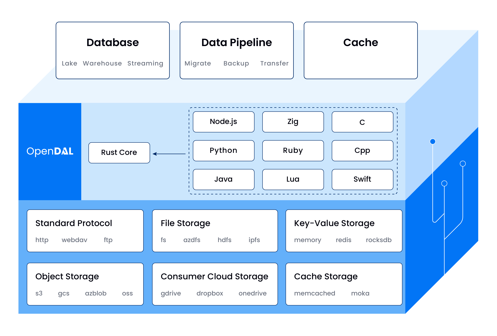

If you're committed to building cloud-native, cross-cloud-first applications and services, or you want to support configurable storage backends to meet complex data access needs, or if you're tired of juggling various SDKs and hoping for a unified abstraction and development experience, Apache OpenDAL™ will be your perfect partner.



<!--truncate-->

## What is OpenDAL?

**OpenDAL** is a data access layer that allows users to easily and efficiently retrieve data from various storage services in a unified way.

**Data Access Layer** means: OpenDAL is in a critical position in the data read-write process. We shield the implementation details of different storage backends and provide a set of unified interface abstractions externally.

Next, let's try to answer *"What OpenDAL is not"* and deconstruct OpenDAL from another perspective:

### Opendal Is Not a Proxy Service

OpenDAL is provided in the form of a library, not as a service or application that proxies various storage backends.

If you want to integrate OpenDAL into an existing project, you need to call OpenDAL's interface directly through the bindings supported by OpenDAL to access the storage services.

### Opendal Is Not an SDK Aggregator

Although OpenDAL replaces various SDKs in the application architecture, it is not implemented as an SDK aggregator.

In other words, OpenDAL does not simply call various storage service SDKs. We have developed our own docking with various storage services based on a unified Rust core to ensure that the differences between services are smoothed out.

For example, for S3, OpenDAL manually constructs HTTP requests and parses HTTP responses to ensure that all behaviors comply with API specifications and are fully under the control of OpenDAL. Due to OpenDAL's native takeover of the data access process, we can easily implement unified retry and logging mechanisms for various storage backends and ensure behavioral consistency.

For compatible services with S3, due to the limitations of native storage services and differences in API implementation, compatibility and behavioral details may differ from S3. For example, OSS needs to set an independent header to ensure consistent behavior for `Range`. In addition to docking with native storage services, OpenDAL will also perform targeted processing for compatible services to ensure users' data access experience.

## Advantages of OpenDAL

OpenDAL is not the only project dedicated to providing data access abstraction, but compared to other similar projects, OpenDAL has the following advantages:

### Rich Service Support

OpenDAL supports dozens of storage services, covering a wide range of scenarios and supporting on-demand selection:

- Standard Storage Protocols: FTP, HTTP, SFTP, WebDAV, etc.
- Object Storage Services: azblob, gcs, obs, oss, s3, etc.
- File Storage Services: fs, azdls, hdfs, webhdfs, ipfs, etc.
- Consumer Cloud Storage Service: Google Drive, OneDrive, Dropbox, etc.
- Key-Value Storage Service: Memory, Redis, Rocksdb, etc.
- Cache Storage Service: Ghac, Memcached, etc.

### Complete Cross-Language Bindings

With Rust as the core, OpenDAL now provides binding support for multiple languages such as Python/Node.js/Java/C and is also actively developing bindings for other languages.

Cross-language bindings not only provide unified storage access abstractions for other languages but also follow naming conventions and development habits that are common in various languages as much as possible to pave the way for quick use.

### Powerful Middleware Support

OpenDAL offers native layer support, enabling users to implement middleware or intercept for all operations.

- Error Retry: OpenDAL supports fine-grained error retry capabilities. In addition to common request retries, it supports breakpoint resumable transmission without having to re-read the entire file.
- Observability: OpenDAL implements logging,tracing,and metrics support for all operations. Turning on middleware can directly obtain observability capabilities for storage.
- Concurrency control, flow control, fuzz testing, and more.

### Easy to Use

OpenDAL's API has been well designed and polished in actual use. The documentation covers everything and is easy to get started with. Here's an example of using Python bindings to access HDFS:

```python
import opendal
    
op = opendal.Operator("hdfs", name_node="hdfs://192.16.8.10.103")
op.read("path/to/file")
```

### Use Cases of OpenDAL

Currently, OpenDAL is widely used in various scenarios that require cloud-native capabilities, including but not limited to databases, data pipelines, and caches. The main user cases include:

- [Databend](https://github.com/datafuselabs/databend/): A modern Elasticity and Performance cloud data warehouse. Using OpenDAL to read and write persistent data (s3, azblob, gcs, hdfs, etc.) and cache data (fs, redis, rocksdb, moka, etc.).
- [GreptimeDB](https://github.com/GreptimeTeam/greptimedb): An open-source, cloud-native, distributed time-series database. Using OpenDAL to read and write persistent data (s3, azblob, etc.).
- [mozilla/sccache](https://github.com/mozilla/sccache/): `sccache` is [`ccache`](https://github.com/ccache/ccache) with cloud storage. Using OpenDAL to read and write cache data (s3 and ghac, etc.).
- [RisingWave](https://github.com/risingwavelabs/risingwave): A Distributed SQL Database for Stream Processing. Using OpenDAL to read and write persistent data (s3, azblob, hdfs, etc.).
- [Vector](https://github.com/vectordotdev/vector): A high-performance observability data pipeline. Using OpenDAL to write persistent data (currently mainly using hdfs).

## Future Plans of OpenDAL

In addition to further meeting the needs of cloud-native data access, OpenDAL will continue to expand user scenarios and actively explore its use in data science and mobile applications. At the same time, OpenDAL will continue to polish its existing implementations and bindings to provide users with a better integration experience.

OpenDAL will also explore how to improve users' workflows in data management and service integration:

- Polish the `oli` command-line tool to help users manage data painlessly.
- Implement the `oay` proxy service to provide users with high-quality compatible APIs.

In addition, since OpenDAL is currently a cross-language project, we also plan to write a series of introductory tutorials to help everyone learn OpenDAL from scratch while learning the language.
