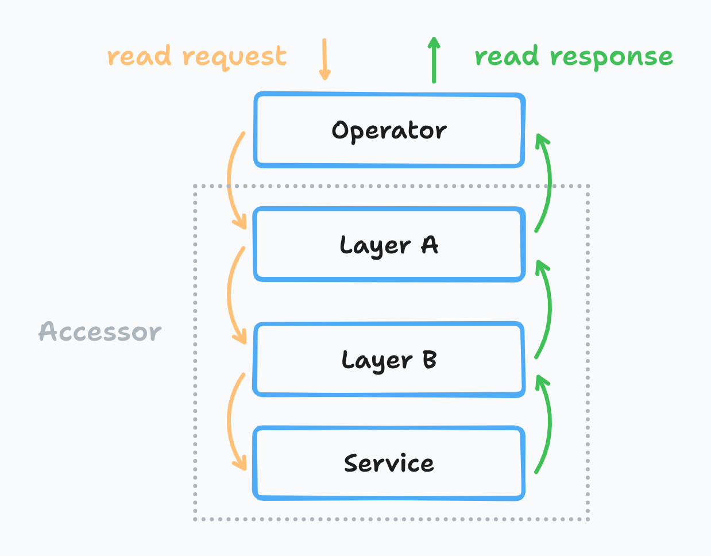
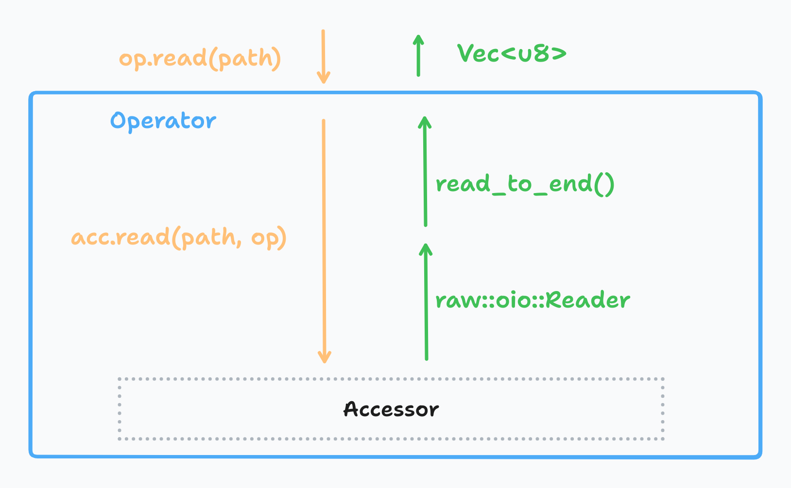

As the OpenDAL community continues to grow, new abstractions are constantly being added, which has brought some burdens to new contributors participating in development. Many maintainers hope to have a deeper understanding of OpenDAL's internal implementation. At the same time, OpenDAL's core design has not changed significantly for a long time, making it possible to write a series on internal implementation. I believe now is the time to write a series of articles on OpenDAL's internal implementation, to explain from the maintainer's perspective how OpenDAL is designed, implemented, and how it can be expanded. With the impending release of OpenDAL v0.40, I hope this series of articles will better help the community understand the past, master the present, and shape the future.

The first article will discuss OpenDAL's most commonly used data reading function. I will start from the outermost interface and then gradually unfold according to the calling sequence of OpenDAL. Let's get started!

## Overall Framework

Before starting to introduce the specific OpenDAL interface, let's first get familiar with the OpenDAL project.

[OpenDAL](https://github.com/apache/incubator-opendal) is an Apache Incubator project aimed at helping users access data from various storage services in a unified, convenient, and efficient way. Its project [vision](https://opendal.apache.org/docs/vision) is "free access to data":

- Free from services: Any service can be accessed freely through native interfaces
- Free from implementations: No matter how the underlying implementation is, it can be called in a unified way
- Free to integrate: Able to freely integrate with various services and languages
- Free to zero cost: Users don't have to pay for features they don't use

On this philosophical foundation, OpenDAL Rust Core can be mainly divided into the following components:

- Operator: The outer interface exposed to users
- Layers: Specific implementation of different middleware
- Services: Specific implementation of different services

From a macroscopic perspective, OpenDAL's data reading call stack would look like this:



All Layers and Services have implemented a unified Accessor interface, erasing all type information when building the Operator. For the Operator, regardless of what services are used or how many middleware are added, all call logic is consistent. This design splits OpenDAL's API into Public API and Raw API, where the Public API is directly exposed to users, providing convenient top-level interfaces, and Raw API is provided to OpenDAL internal developers, maintaining a unified internal interface and providing some convenient implementation.

## Operator

OpenDAL's Operator API will adhere to a consistent calling paradigm as much as possible, reducing users' learning and usage costs. For example, OpenDAL offers the following APIs for `read`:

- `op.read(path)`: Reads the entire content of the specified file
- `op.reader(path)`: Creates a Reader for streaming reading
- `op.read_with(path).range(1..1024)`: Reads file content using specified parameters, such as range
- `op.reader_with(path).range(1..1024)`: Creates a Reader for streaming reading with specified parameters

It's not hard to see that `read` is more like syntactic sugar, allowing users to quickly read files without considering various traits like `AsyncRead`. The `reader` provides more flexibility, implementing widely-used community traits like `AsyncSeek`, `AsyncRead`, allowing more flexible data reading. `read_with` and `reader_with` assist users in specifying various parameters in a more natural way through Future Builder functions.

The internal logic of the Operator would look like this:



Its main job is to encapsulate the interface for the user:

- Completing the construction of `OpRead`: the args for read operation.
- Calling the `read` function provided by `Accessor`
- Wrapping the returned value as `Reader` and implementing interfaces like `AsyncSeek`, `AsyncRead`, etc., based on `Reader`

## Layers

A little secret here is that OpenDAL will automatically apply some Layers to the Service to implement some internal logic. As of the completion of this article, OpenDAL's automatically added Layers include:

- `ErrorContextLayer`: Injects context information, such as `scheme`, `path`, etc., into all returned errors of Operation
- `CompleteLayer`: Adds necessary capabilities to services, such as adding seek support to s3
- `TypeEraseLayer`: Implements type erasure, uniformly erasing associated types in `Accessor`, so users don't need to carry generic parameters when using it

Here, `ErrorContextLayer` and `TypeEraseLayer` are relatively simple and won't be elaborated on. The focus is on `CompleteLayer`, aimed at adding `seek` or `next` support to OpenDAL's returned `Reader` in a zero-cost way, so users don't have to re-implement it. OpenDAL initially returned `Reader` and `SeekableReader` through different function calls in early versions, but the actual user feedback was not very good; almost all users were using `SeekableReader`. Therefore, OpenDAL subsequently added seek support as the first priority to the internal `Read` trait during the refactor:

```rust
pub trait Read: Unpin + Send + Sync {
    /// Read bytes asynchronously.
    fn poll_read(&mut self, cx: &mut Context<'_>, buf: &mut [u8]) -> Poll<Result<usize>>;

    /// Seek asynchronously.
    ///
    /// Returns `Unsupported` error if underlying reader doesn't support seek.
    fn poll_seek(&mut self, cx: &mut Context<'_>, pos: io::SeekFrom) -> Poll<Result<u64>>;

    /// Stream [`Bytes`] from underlying reader.
    ///
    /// Returns `Unsupported` error if underlying reader doesn't support stream.
    ///
    /// This API exists for avoiding bytes copying inside async runtime.
    /// Users can poll bytes from underlying reader and decide when to
    /// read/consume them.
    fn poll_next(&mut self, cx: &mut Context<'_>) -> Poll<Option<Result<Bytes>>>;
}
```

To implement a service's reading capability in OpenDAL, one needs to implement this trait, which is an internal interface and will not be directly exposed to users. Among them:

- `poll_read` is the most basic requirement; all services must implement this interface.
- When the service natively supports `seek`, `poll_seek` can be implemented, and OpenDAL will correctly dispatch, such as local fs;
- When the service natively supports `next`, meaning it returns streaming Bytes, `poll_next` can be implemented, like HTTP-based services, where the underlying layer is a TCP Stream, and hyper will encapsulate it as a bytes stream.

Through the `Read` trait, OpenDAL ensures that all services can expose their native support capabilities as much as possible, thereby achieving efficient reading for different services.

Based on this trait, OpenDAL will complete according to the capabilities supported by each service:

- Both seek/next are supported: Direct return
- No support for next: Encapsulate using `StreamableReader` to simulate next support
- No support for seek: Encapsulate using `ByRangeSeekableReader` to simulate seek support
- Neither seek/next supported: Encapsulate using both methods

> `ByRangeSeekableReader` mainly utilizes the service's ability to support range read, dropping the current reader when the user seeks and initiating a new request at the specified location.

OpenDAL exposes a unified Reader implementation through `CompleteLayer`, so users don't have to worry about whether the underlying service supports seek; OpenDAL will always choose the optimal way to initiate the request.

## Services

After the completion of the Layers, it's time to call the specific implementation of the Service. Here, the most common services `fs` and `s3` are used as examples to explain how data is read.

### Service fs

`tokio::fs::File` implements `tokio::AsyncRead` and `tokio::AsyncSeek`. Using `async_compat::Compat`, we have transformed it into `futures::AsyncRead` and `futures::AsyncSeek`. Based on this, we provide a built-in function `oio::into_read_from_file` to transform it into a type that implements `oio::Read`.

There's nothing particularly complex in the implementation of `oio::into_read_from_file`; read and seek are mostly calling the functions provided by the incoming File type. The tricky part is about the correct handling of seek and range: seeking to the right side of the range is allowed, and this will not cause an error, and reading will only return empty, but seeking to the left side of the range is illegal, and the Reader must return `InvalidInput` for proper upper-level handling.

> Interesting history: there was [an issue](https://github.com/apache/incubator-opendal/issues/2717) in the initial implementation of this part, discovered during fuzz testing.

### Services s3

S3 is an HTTP-based service, and opendal provides a lot of HTTP-based wrappers to help developers reuse logic; they only need to build a request and return a well-constructed Body. OpenDAL Raw API encapsulates a set of reqwest-based interfaces, and the HTTP GET interface returns a `Response<IncomingAsyncBody>`:

```rust
/// IncomingAsyncBody carries the content returned by remote servers.
pub struct IncomingAsyncBody {
    /// # TODO
    ///
    /// hyper returns `impl Stream<Item = crate::Result<Bytes>>` but we can't
    /// write the types in stable. So we will box here.
    ///
    /// After [TAIT](https://rust-lang.github.io/rfcs/2515-type_alias_impl_trait.html)
    /// has been stable, we can change `IncomingAsyncBody` into `IncomingAsyncBody<S>`.
    inner: oio::Streamer,
    size: Option<u64>,
    consumed: u64,
    chunk: Option<Bytes>,
}
```

The stream contained in this body is the bytes stream returned by reqwest, and opendal implements content length checks and read support on this basis.

Here's an extra note about a small pitfall with reqwest/hyper: reqwest and hyper do not check the returned content length, so an illegal server may return a data volume that does not match the expected content length instead of an error, leading to unexpected data behavior. OpenDAL specifically added checks here, returning `ContentIncomplete` when data is insufficient and `ContentTruncated` when data exceeds expectations, avoiding users receiving illegal data.

## Conclusion

This article introduces from top to bottom how OpenDAL implements data reading:

- Operator is responsible for exposing user-friendly interfaces
- Layers are responsible for completing the capabilities of the services
- Services are responsible for the specific implementation of different services

Throughout the entire chain, OpenDAL adheres as much as possible to the principle of zero cost, prioritizing the use of native service capabilities, then considering simulation through other methods, and finally returning unsupported errors. Through this three-tier design, users don't need to understand the details of the underlying service, nor do they need to integrate different service SDKs to easily call `op.read(path)` to access data in any storage service.

This is: How **OpenDAL** read data freely!
